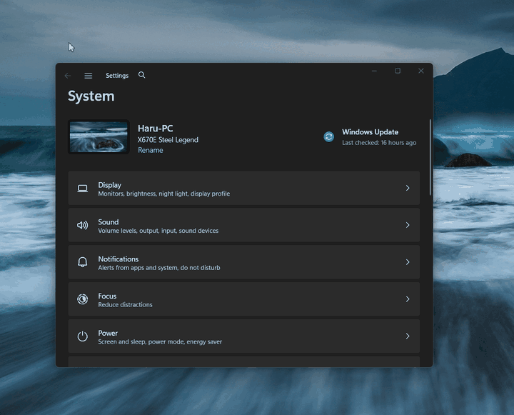

# AnyMove

[](https://github.com/wolfdate25/AnyMove/releases) [](LICENSE) [](https://github.com/wolfdate25/AnyMove/releases)

[한국어](README.ko.md) · [English](README.md)

即使窗口标题栏很窄或难以抓取，也能通过组合键 + 鼠标拖拽、
按住窗口任意位置移动整个窗口的 Windows 常驻工具。




## 使用方法

- `Win + 左键拖拽`：无论按住窗口的正文、按钮等哪个区域，整个顶层窗口都会跟随移动
- 组合键可在托盘菜单中切换为 `Win` / `Alt`
- `Esc` 或松开按键结束移动
- 不按组合键的普通点击与原来完全一致

## 安装

从 [Releases](../../releases) 下载 `AnyMove-Setup-<版本>.exe` 安装。
安装程序会在任务计划程序中注册登录任务（最高权限），
使 AnyMove 以管理员权限自动启动，且无 UAC 提示。

## 自行构建

需要：.NET 8 SDK、Inno Setup 6（`ISCC` 在 PATH 中）

```powershell
# 在仓库根目录执行
dotnet publish src/AnyMove/AnyMove.csproj -c Release -r win-x64 --self-contained true /p:PublishSingleFile=true -o dist/app
ISCC installer/anymove.iss
```

详细方法见 [BUILD.md](BUILD.md)，技术设计见 [docs/design.md](docs/design.md)，
开发计划见 [plan.md](plan.md)。

## 注意事项

- 为移动管理员权限窗口，以 `requireAdministrator` 运行，启动时会请求 UAC 同意。
- 未经代码签名，首次运行时 SmartScreen 可能会发出警告。
- 使用全局输入钩子，杀毒/安全软件可能会误报。

## 许可证

MIT — [LICENSE](LICENSE)
